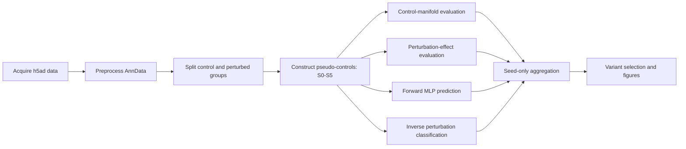

# Pseudo-pairing for Perturb-seq

A configurable and restartable workflow for constructing pseudo-controls in single-cell perturbation datasets and quantifying how pairing choices affect downstream analyses.

The repository is centered on the **pseudo-pairing workflow**. It provides an end-to-end implementation for data acquisition, AnnData preprocessing, pseudo-control construction, control-distribution evaluation, perturbation-effect evaluation, forward post-perturbation prediction, inverse perturbation-identity classification, result aggregation, and visualization.

Two optional side branches are included for downstream analyses with single-cell foundation-model encoders and gene-program representations. These extensions consume outputs from the main workflow but do not alter its pairing strategies, evaluation definitions, or execution order.

> **Status:** Research software prototype. The package structure, configuration system, command-line interface, and lightweight tests have been validated. Before replacing an established production workflow, confirm numerical equivalence in the target Scanpy, SEACells, POT, and PyTorch environment.

## Core workflow



The principal execution sequence is:

```text
acquire -> preprocess -> pair -> evaluate -> aggregate
```

Each stage can be run independently, which allows expensive jobs to be scheduled separately and incomplete experiments to be resumed without rerunning completed outputs.

## Main features

- One YAML or JSON configuration for the complete pseudo-pairing workflow.
- One CLI for acquisition, preprocessing, pairing, evaluation, and aggregation.
- Six pseudo-control strategies, S0-S5.
- Reusable SEACell memberships and cached optimal-transport assignments.
- Independent stage execution for local workstations and HPC systems.
- Existing-output detection for interrupted or repeated experiments.
- Metrics for control-distribution and perturbation-effect preservation.
- Forward MLP evaluation of restored expression and perturbation effects.
- Inverse MLP evaluation of multiclass perturbation identity.
- Aggregation across random seeds while retaining strategy-defining hyperparameters.
- Stage-level provenance, resolved configurations, manifests, and QC files.

## Repository structure

```text
Pseudo-pairing-for-Perturb-Seq/
├── README.md
├── pseudo_pairing_toolkit/          # Main workflow
│   ├── configs/
│   │   ├── pipeline.example.yaml
│   │   └── replogle_rpe.ibex.example.yaml
│   ├── examples/
│   │   ├── custom_mlp_models.py
│   │   └── smoke_test_scientific.py
│   ├── legacy_notebooks/
│   ├── legacy_sources/
│   ├── slurm/
│   │   └── run_pipeline.sbatch
│   ├── src/pseudopair/
│   │   ├── acquisition.py
│   │   ├── preprocessing.py
│   │   ├── pairing/
│   │   ├── evaluation/
│   │   ├── analysis/
│   │   ├── config.py
│   │   ├── pipeline.py
│   │   └── cli.py
│   ├── tests/
│   ├── AUDIT_AND_MIGRATION.md
│   ├── pyproject.toml
│   └── README.md
├── foundation_model_encoders/       # Optional encoder branch
│   └── README.md
└── gene_program_evaluation/         # Optional gene-program branch
    └── README.md
```

The remainder of this README documents the main workflow in `pseudo_pairing_toolkit/`. The two optional branches are summarized near the end and documented in their respective folder-level README files.

## Requirements

- Python 3.10 or newer.
- Scanpy and AnnData for preprocessing and h5ad operations.
- SEACells for strategies S3-S5.
- POT for the optimal-transport operations used by S5.
- PyTorch for forward and inverse MLP evaluation.
- A CUDA-capable PyTorch installation is optional; CPU execution is supported.

SEACells is not installed automatically because installation procedures may differ across local and HPC environments.

## Installation

### Editable installation from the repository

```bash
git clone git@github.com:CHENJ-VV/Pseudo-pairing-for-Perturb-Seq.git
cd Pseudo-pairing-for-Perturb-Seq/pseudo_pairing_toolkit
python -m pip install --upgrade pip
python -m pip install -e ".[full]"
```

Install SEACells in the same environment using the method appropriate for your system. Then inspect dependency availability:

```bash
pseudopair doctor
```

### Installation from the wheel

```bash
python -m pip install pseudopair_toolkit-0.1.0-py3-none-any.whl
```

The wheel contains the CLI and package modules. SEACells must still be installed separately.

### Optional dependency groups

```bash
# Scanpy/AnnData, scientific computing, and plotting
python -m pip install -e ".[core]"

# PyTorch-based MLP evaluation
python -m pip install -e ".[mlp]"

# POT-based optimal transport
python -m pip install -e ".[ot]"

# Complete declared dependency set
python -m pip install -e ".[full]"

# Development and testing tools
python -m pip install -e ".[dev]"
```

## Quick start

Run the following commands from `pseudo_pairing_toolkit/` after installation.

### 1. Create an editable configuration

```bash
pseudopair init pseudopair.yaml
```

To replace an existing file:

```bash
pseudopair init pseudopair.yaml --force
```

The generated template contains settings for every workflow stage.

### 2. Validate the configuration

```bash
pseudopair validate --config pseudopair.yaml
```

Also verify explicitly configured input files:

```bash
pseudopair validate --config pseudopair.yaml --check-files
```

### 3. Inspect the resolved execution plan

```bash
pseudopair plan --config pseudopair.yaml
```

Relative paths are resolved against the directory containing the configuration file. Environment variables and `~` are expanded.

### 4. Perform a dry run

```bash
pseudopair run --config pseudopair.yaml --stage all --dry-run
```

A dry run resolves the enabled stages and output paths without loading the optional scientific dependencies.

### 5. Run the workflow

```bash
pseudopair run --config pseudopair.yaml --stage all
```

For large datasets, run the stages separately:

```bash
pseudopair run --config pseudopair.yaml --stage acquire
pseudopair run --config pseudopair.yaml --stage preprocess
pseudopair run --config pseudopair.yaml --stage pair
pseudopair run --config pseudopair.yaml --stage evaluate
pseudopair run --config pseudopair.yaml --stage aggregate
```

When `--stage all` is used, only stages with `enabled: true` are executed.

## Common starting points

### Start from a raw h5ad file

Enable preprocessing and provide `preprocessing.input_h5ad`:

```yaml
project:
  dataset_id: Replogle_K562_essential
  workdir: ./work

acquisition:
  enabled: false

preprocessing:
  enabled: true
  input_h5ad: ./data/raw/Replogle_K562_essential.h5ad
  output_dir: ./work/processed/Replogle_K562_essential
  groups: [control, single]

pairing:
  enabled: true
  control_group: control
  perturbed_groups: [single]
  output_root: ./work/pairing

evaluation:
  enabled: true
  eval_root: ./work/evaluation/Replogle_K562_essential_pseudo_pairing_evaluation

analysis:
  enabled: true
```

The preprocessing stage writes group-specific h5ad files and records their locations in `preprocessing_summary.json`. The pairing and evaluation stages can then resolve these files automatically.

### Start from processed control and perturbed h5ad files

Disable preprocessing and define the inputs directly:

```yaml
project:
  dataset_id: Replogle_RPE
  workdir: ./work

acquisition:
  enabled: false

preprocessing:
  enabled: false

pairing:
  enabled: true
  control_h5ad: ./data/Replogle_RPE_control_processed.h5ad
  perturbed_h5ads:
    single: ./data/Replogle_RPE_single_processed.h5ad
  output_root: ./work/pairing
  strategies_to_run:
    - S0_naive_mean_control_reference
    - S1_random_single_control
    - S2_random_average_controls
    - S3_SEACell_metacell_average
    - S4_SEACell_balanced_random_sample
    - S5_SEACell_OT_sampled_average

evaluation:
  enabled: true
  eval_root: ./work/evaluation/Replogle_RPE_pseudo_pairing_evaluation
  perturbed_groups_to_evaluate: [single]

analysis:
  enabled: true
  perturbed_groups: [single]
```

A complete generic configuration is available at `configs/pipeline.example.yaml`. An IBEX-oriented example is available at `configs/replogle_rpe.ibex.example.yaml`.

## Input data contract

### Preprocessing input

The preprocessing module expects an AnnData object with observation columns describing perturbation identity and, when applicable, perturbation multiplicity. The default configuration expects:

```text
adata.obs["nperts"]
adata.obs["gene"]
adata.obs["condition"]
```

These names can be changed under `preprocessing.annotation`.

The preprocessing stage can:

- classify cells as `control`, `single`, `dual`, or `multi` from `nperts`;
- create a standardized perturbation key;
- preserve raw counts in a layer;
- normalize library size and apply log transformation;
- select highly variable genes;
- calculate PCA, neighbors, Leiden clusters, and UMAP;
- export control and perturbed groups as separate h5ad files.

### Direct pairing input

When preprocessing is disabled, the pairing stage requires:

- one control h5ad file;
- one or more perturbed h5ad files;
- compatible gene identifiers across control and perturbed objects;
- a perturbation-identity column in each perturbed object's `obs` table.

Strategies S3-S5 additionally require a PCA-like representation, normally:

```python
adata.obsm["X_pca"]
```

The representation key is controlled by `pairing.embedding_key`.

## Pseudo-pairing strategies

| Strategy | Description | Main varying parameters |
|---|---|---|
| `S0_naive_mean_control_reference` | Assigns the global mean control-expression profile to every perturbed cell. | None |
| `S1_random_single_control` | Randomly samples one true control cell for each perturbed cell. | Random seed |
| `S2_random_average_controls` | Randomly samples and averages `k` true control cells for each perturbed cell. | `k`, random seed |
| `S3_SEACell_metacell_average` | Randomly samples `k` control metacell profiles and averages them. | Metacell number, `k`, random seed |
| `S4_SEACell_balanced_random_sample` | Balances metacell assignment within each perturbation identity and samples one true control cell from the assigned metacell. | Metacell number, random seed |
| `S5_SEACell_OT_sampled_average` | Computes perturbation-wise entropic optimal transport between perturbed cells and control metacells, retains the top-k metacells, samples true controls from those metacells, and constructs an OT-weighted average. | Metacell number, top-k, OT settings, random seed |

Example strategy configuration:

```yaml
pairing:
  strategies_to_run:
    - S0_naive_mean_control_reference
    - S1_random_single_control
    - S2_random_average_controls
    - S3_SEACell_metacell_average
    - S4_SEACell_balanced_random_sample
    - S5_SEACell_OT_sampled_average

  random_seeds: [0, 1, 2, 3, 4]
  s2_n_control_cells_to_average_values: [100]
  s3_n_metacells_to_average_values: [3, 5, 10]
  s5_top_k_values: [1, 3, 5]

  seacell_settings:
    - setting_id: nmc_350
      n_metacells: 350
      n_waypoint_eigs: 10
      seacells_n_iter: 100
      seacell_seed: 42

  sample_cells_per_metacell: 10
  ot_reg: 0.05
  ot_max_iter: 2000
  ot_tol: 1.0e-7
  cost_metric: sqeuclidean
  control_mass: size
```

## Stage-by-stage usage

### Acquisition

The acquisition stage accepts either a public URL or a local source file. An optional SHA-256 checksum can be supplied.

```yaml
acquisition:
  enabled: true
  overwrite: false
  files:
    - url: https://example.org/dataset.h5ad
      output: ./data/raw/dataset.h5ad
      sha256: optional_expected_checksum

    - source_path: /shared/data/another_dataset.h5ad
      output: ./data/raw/another_dataset.h5ad
```

Run:

```bash
pseudopair run --config pseudopair.yaml --stage acquire
```

Downloads are first written to a `.part` file and atomically renamed after completion.

### Preprocessing

```bash
pseudopair run --config pseudopair.yaml --stage preprocess
```

Typical outputs:

```text
<preprocessing.output_dir>/
├── <dataset>_global_processed.h5ad
├── groups/
│   ├── <dataset>_control_processed.h5ad
│   └── <dataset>_single_processed.h5ad
├── preprocessing_manifest.csv
└── preprocessing_summary.json
```

The final group-specific expression matrices are not restricted to the highly variable genes used to calculate the embeddings.

### Pairing

```bash
pseudopair run --config pseudopair.yaml --stage pair
```

The pairing stage creates the selected S0-S5 variants across the requested seeds and parameter combinations. A top-level manifest records every generated pseudo-control file and its variant metadata.

Typical outputs:

```text
<pairing.output_root>/<dataset_id>/
├── pseudo_pairing_repetition_manifest.csv
├── _seacell_memberships/
└── <perturbed_group>/
    ├── S0_naive_mean_control_reference/
    ├── S1_random_single_control/
    ├── S2_random_average_controls/
    ├── S3_SEACell_metacell_average/
    ├── S4_SEACell_balanced_random_sample/
    └── S5_SEACell_OT_sampled_average/
```

Each variant contains an aligned pseudo-control h5ad file, pairing metadata, strategy settings, and QC information. Complete outputs are reused unless the relevant overwrite option is enabled.

Useful limits for development runs:

```yaml
pairing:
  max_pairs_per_perturbation: 300
  random_seeds: [0]
  seacell_settings:
    - setting_id: nmc_50
      n_metacells: 50
```

### Evaluation

```bash
pseudopair run --config pseudopair.yaml --stage evaluate
```

Evaluation families:

| Family | Purpose |
|---|---|
| `control_manifold` | Quantifies how well pseudo-controls preserve the control-cell distribution and manifold. |
| `perturbation_effect` | Quantifies the preservation and consistency of estimated perturbation effects across pairing strategies. |
| `mlp` | Runs forward post-perturbation prediction and inverse perturbation-identity classification. |

Example:

```yaml
evaluation:
  evaluation_tasks:
    - control_manifold
    - perturbation_effect
    - mlp

  mlp_tasks:
    - forward
    - inverse_strategy_delta
    - inverse_common_delta

  max_eval_genes: 3000
  device: auto
  forward_epochs: 30
  inverse_epochs: 30
  skip_existing_forward: true
  skip_existing_inverse: true
```

For each perturbed group, results are written under:

```text
<evaluation.eval_root>/<perturbed_group>/
```

Use `evaluation.max_runs_to_evaluate` to test a small number of variants before launching the complete evaluation.

### Aggregation and visualization

Aggregation uses a two-pass procedure so that candidate strategy variants can be reviewed before the final comparison.

#### Pass 1: aggregate runs and create the selection template

```yaml
analysis:
  enabled: true
  run_aggregation: true
  run_final_comparison: false
```

Run:

```bash
pseudopair run --config pseudopair.yaml --stage aggregate
```

This creates:

```text
<evaluation.eval_root>/<group>/result_analysis/
└── selected_variants_TEMPLATE_EDIT_ME.csv
```

Aggregation averages only across random seeds. Parameters such as metacell number, number of averaged metacells, and OT top-k remain separate canonical variants.

Edit only the intended selection and presentation columns, including:

```text
select_for_final
manual_color
final_strategy_label
```

#### Pass 2: generate the final comparison figures

Update the configuration:

```yaml
analysis:
  run_aggregation: false
  run_final_comparison: true
  selection_path: ./work/evaluation/<dataset>/<group>/result_analysis/selected_variants_TEMPLATE_EDIT_ME.csv
```

Then rerun:

```bash
pseudopair run --config pseudopair.yaml --stage aggregate
```

## Restart and overwrite behavior

The workflow runs synchronously, but every stage records its state and outputs in:

```text
<project.workdir>/pipeline_runs/<dataset_id>/pipeline_state.json
```

The same directory contains the fully resolved configuration:

```text
<project.workdir>/pipeline_runs/<dataset_id>/resolved_config.yaml
```

The pipeline state records:

- the configuration SHA-256 hash;
- Python and platform information;
- stage start and completion timestamps;
- completion or failure status;
- output paths;
- recorded exceptions.

The pairing and MLP stages also retain their existing complete-output detection. To force selected pairing computations, change the relevant options:

```yaml
pairing:
  overwrite_existing_outputs: false
  overwrite_memberships: false
  overwrite_assignments: false
  overwrite_sampled_outputs: false
```

## HPC and SLURM usage

The included SLURM template accepts a configuration path and stage name:

```bash
sbatch slurm/run_pipeline.sbatch configs/replogle_rpe.ibex.example.yaml pair
sbatch slurm/run_pipeline.sbatch configs/replogle_rpe.ibex.example.yaml evaluate
sbatch slurm/run_pipeline.sbatch configs/replogle_rpe.ibex.example.yaml aggregate
```

Edit the resource directives and environment-activation commands in `slurm/run_pipeline.sbatch` for the target cluster.

Recommended production pattern:

1. Validate the configuration and input paths on a login node.
2. Run preprocessing once.
3. Run pseudo-pairing as a high-memory job.
4. Run MLP evaluation on a GPU node when available.
5. Run aggregation after all expected metric files are present.

## Python API

Run selected stages programmatically:

```python
from pseudopair.config import load_config
from pseudopair.pipeline import run_pipeline

config = load_config("pseudopair.yaml")
outputs = run_pipeline(config, stages=["pair", "evaluate"])
```

Lower-level entry points are also available:

```python
from pseudopair.pairing import run_pseudo_pairing_repetition_plan
from pseudopair.evaluation import run_evaluation_pipeline
from pseudopair.analysis import run_result_analysis_pipeline
```

Custom forward or inverse MLP model factories can be supplied through the Python API. See `examples/custom_mlp_models.py`.

## Optional side branches

The following folders provide downstream extensions. They are intentionally separated from the main pseudo-pairing package and are not required to run S0-S5 or the core evaluation workflow.

### Foundation-model encoders

`foundation_model_encoders/` applies alternative single-cell representation models, including repository-based implementations of Geneformer, scGPT, scCello, SCimilarity, and scVI/HVG-based encoders. It uses a folder-level configuration to resolve repository locations, checkpoints, environments, input manifests, and output paths.

The encoder branch can be used to compare downstream prediction performance across expression-based and pretrained representations. It does not modify pseudo-control construction or the core pairing manifest.

See [`foundation_model_encoders/README.md`](foundation_model_encoders/README.md) for installation, configuration, and execution instructions.

### Gene-program evaluation

`gene_program_evaluation/` constructs and evaluates gene-program representations from the outputs of the pseudo-pairing workflow. It can read the shared pairing manifest and resolved run configuration or use explicitly configured input paths.

The gene-program branch is an optional downstream analysis and does not alter the S0-S5 pairing strategies or their primary evaluation metrics.

See [`gene_program_evaluation/README.md`](gene_program_evaluation/README.md) for configuration and usage instructions.

## Testing

Run configuration and package tests from `pseudo_pairing_toolkit/`:

```bash
python -m pip install -e ".[dev]"
pytest
```

Run the scientific smoke test in an environment containing Scanpy, AnnData, SEACells, POT, and PyTorch:

```bash
python examples/smoke_test_scientific.py
```

Before replacing an existing workflow, compare at least one small real-dataset S0-S5 run against the original manifest, pairing metadata, and metric tables.

## Troubleshooting

### `pseudopair: command not found`

Confirm that the package is installed in the active environment:

```bash
python -m pip show pseudopair-toolkit
python -m pseudopair --help
```

### SEACells is reported as unavailable

Install SEACells in the same Python environment and rerun:

```bash
pseudopair doctor
```

### S3-S5 cannot find `X_pca`

Run preprocessing with PCA enabled or provide h5ad files containing the representation specified by:

```yaml
pairing:
  embedding_key: X_pca
```

### `seurat_v3` HVG calculation fails

The Scanpy `seurat_v3` workflow may require `scikit-misc`:

```bash
python -m pip install scikit-misc
```

### S5 uses excessive memory

Reduce one or more of the following settings:

```yaml
pairing:
  max_pairs_per_perturbation: 300
  s5_top_k_values: [5]
  seacell_settings:
    - setting_id: nmc_100
      n_metacells: 100
```

When appropriate, run perturbation groups separately.

### Evaluation takes too long during testing

Use reduced limits:

```yaml
evaluation:
  max_runs_to_evaluate: 2
  forward_epochs: 3
  inverse_epochs: 3
```

### Relative paths resolve unexpectedly

All relative paths are resolved against the directory containing the configuration file, not the terminal's current working directory. Inspect the resolved paths with:

```bash
pseudopair plan --config pseudopair.yaml
```

## Reproducibility notes

- Random pairing repetitions are controlled by `pairing.random_seeds`.
- Pair subsampling is controlled by `pairing.pair_selection_seed`.
- Train, validation, and test splitting is controlled by `evaluation.split_seed`.
- MLP initialization and training are controlled by `evaluation.model_seed`.
- SEACell construction uses the seed specified in each `seacell_settings` entry.
- The resolved configuration and its hash are recorded for each run.
- Aggregation removes seed variation only; scientifically meaningful strategy parameters remain separate.

## Migration from the original scripts

The original scripts and notebooks are retained under `pseudo_pairing_toolkit/legacy_sources/` and `pseudo_pairing_toolkit/legacy_notebooks/`. A detailed original-to-package mapping and refactor audit is available in [`pseudo_pairing_toolkit/AUDIT_AND_MIGRATION.md`](pseudo_pairing_toolkit/AUDIT_AND_MIGRATION.md).

The scientific definitions of S0-S5 and the existing evaluation families were transferred without intentional redesign. The main changes concern packaging, configuration, stage orchestration, path handling, restart behavior, and documentation.

## Citation

A formal software citation has not yet been assigned. Until a release archive or DOI is available, cite the associated methodological manuscript and record the toolkit version, repository commit, and resolved configuration used for the analysis.

## License

No open-source license is currently included in this research prototype. Add an appropriate license before publishing the repository for external reuse or redistribution.
