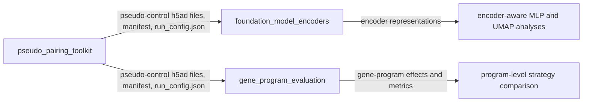

# Single-cell perturbation workflows

This repository contains three independent but interoperable workflows for pseudo-control construction and evaluation in single-cell perturbation data. Each workflow is listed as a separate top-level GitHub folder and has its own configuration, dependencies, command-line entry point, and README.

## Repository structure

```text
single_cell_perturbation_workflows/
├── pseudo_pairing_toolkit/       # Acquisition, preprocessing, S0-S5 pairing, evaluation, aggregation
├── foundation_model_encoders/    # Geneformer/scGPT/scCello/SCimilarity/scVI/HVG representations
├── gene_program_evaluation/      # Control-derived gene programs and program-level effect evaluation
├── .gitignore
└── README.md
```

## How the folders connect



The folders do not import one another. Integration is file-based:

- `pseudo_pairing_toolkit` writes processed h5ad files, pseudo-control h5ad files, `pseudo_pairing_repetition_manifest.csv`, and `run_config.json`.
- `foundation_model_encoders` reads those h5ad files and manifests using `configs/encoders.yaml`.
- `gene_program_evaluation` resolves the same pairing outputs using `configs/gene_program.example.json` or an explicit dataset configuration.

## Entry points

### Pseudo-pairing workflow

```bash
cd pseudo_pairing_toolkit
python -m pip install -e ".[full]"
pseudopair validate --config configs/pipeline.example.yaml
pseudopair run --config configs/pipeline.example.yaml --stage all
```

See [`pseudo_pairing_toolkit/README.md`](pseudo_pairing_toolkit/README.md).

### Foundation-model encoders

```bash
cd foundation_model_encoders
python -m pip install -r requirements-launcher.txt
cp configs/encoders.example.yaml configs/encoders.local.yaml
python launcher.py validate --config configs/encoders.local.yaml
python launcher.py run --config configs/encoders.local.yaml --model scgpt
```

The model-specific environments and upstream repositories are configured in YAML. See [`foundation_model_encoders/README.md`](foundation_model_encoders/README.md).

### Gene-program evaluation

```bash
cd gene_program_evaluation
python -m pip install -e .
cp configs/gene_program.example.json configs/gene_program.local.json
python run_gene_program_pipeline.py \
  --config configs/gene_program.local.json \
  --prepare-only
python run_gene_program_pipeline.py \
  --config configs/gene_program.local.json \
  --build --evaluate
```

See [`gene_program_evaluation/README.md`](gene_program_evaluation/README.md).

## Recommended execution order

1. Run acquisition/preprocessing and S0-S5 pseudo-pairing in `pseudo_pairing_toolkit`.
2. Run the standard distribution, perturbation-effect, forward-MLP, and inverse-MLP evaluations.
3. Optionally generate alternative representations in `foundation_model_encoders`.
4. Run `gene_program_evaluation` to compare pseudo-control strategies at the control-derived gene-program level.
5. Aggregate each analysis using the output tables documented in the corresponding folder.

## Portability

All maintained entry points resolve relative paths against their configuration file location and expand `~` and environment variables. Machine-specific data roots, repository checkouts, checkpoints, Python executables, and output locations should be changed in local configuration files rather than in source code.

## Research-software status

These workflows preserve the calculations of the uploaded research scripts while replacing machine-specific path and execution assumptions. Validate numerical equivalence in the intended Scanpy, SEACells, POT, PyTorch, and model-specific environments before replacing an established production run.
