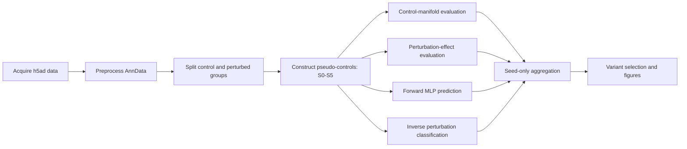

# PseudoPairingToolkit

A configurable and restartable workflow for constructing pseudo-control pairs in single-cell perturbation data and evaluating how pairing choices affect downstream analysis.

The toolkit consolidates data acquisition, AnnData preprocessing, pseudo-control construction, distribution-preservation evaluation, perturbation-effect evaluation, forward prediction, inverse perturbation classification, result aggregation, and visualization into one installable Python package and command-line interface.

> **Status:** research software prototype. The package structure, configuration loading, CLI, and lightweight tests have been validated. Numerical equivalence should be confirmed in the target Scanpy/SEACells/POT environment before replacing an established production workflow.

## Workflow



## Main features

- One YAML or JSON configuration for the complete workflow.
- One CLI for acquisition, preprocessing, pairing, evaluation, and aggregation.
- Six pseudo-control strategies, S0-S5.
- Reusable SEACell memberships and cached OT assignments.
- Independent execution of expensive stages for HPC scheduling.
- Existing-output detection for interrupted or repeated experiments.
- Control-distribution and perturbation-effect preservation metrics.
- Forward MLP evaluation for restored expression and perturbation effects.
- Inverse MLP evaluation for multiclass perturbation identity.
- Aggregation that averages random seeds while preserving strategy-defining hyperparameters.
- Stage-level provenance, resolved configurations, manifests, and QC files.

## Repository structure

```text
pseudo_pairing_toolkit/
├── configs/
│   ├── pipeline.example.yaml
│   └── replogle_rpe.ibex.example.yaml
├── examples/
│   ├── custom_mlp_models.py
│   └── smoke_test_scientific.py
├── legacy_notebooks/          # Original execution notebooks
├── legacy_sources/            # Original scripts retained for reference
├── slurm/
│   └── run_pipeline.sbatch
├── src/pseudopair/
│   ├── acquisition.py
│   ├── preprocessing.py
│   ├── pairing/
│   ├── evaluation/
│   ├── analysis/
│   ├── config.py
│   ├── pipeline.py
│   └── cli.py
├── tests/
├── AUDIT_AND_MIGRATION.md
├── pyproject.toml
└── README.md
```

## Requirements

- Python 3.10 or newer.
- Scanpy and AnnData for preprocessing and h5ad operations.
- SEACells for strategies S3-S5.
- POT for the optimal-transport operations used by S5.
- PyTorch for forward and inverse MLP evaluation.
- A CUDA-capable PyTorch installation is optional; CPU execution remains supported.

SEACells is intentionally not installed automatically because installation practices can differ across local and HPC environments.

## Installation

### Editable installation from the repository

```bash
git clone <YOUR_GITHUB_REPOSITORY_URL> single_cell_perturbation_workflows
cd single_cell_perturbation_workflows/pseudo_pairing_toolkit
python -m pip install --upgrade pip
python -m pip install -e ".[full]"
```

Install SEACells in the same environment using the method appropriate for your system. Then inspect dependency availability:

```bash
pseudopair doctor
```

### Installation from the wheel

```bash
python -m pip install pseudopair_toolkit-0.1.0-py3-none-any.whl
```

The wheel includes the CLI and package modules, but SEACells must still be installed separately.

### Optional dependency groups

```bash
# Scanpy/AnnData, scientific computing, and plotting
python -m pip install -e ".[core]"

# PyTorch-based MLP evaluation
python -m pip install -e ".[mlp]"

# POT-based optimal transport
python -m pip install -e ".[ot]"

# Complete declared dependency set
python -m pip install -e ".[full]"

# Development and testing tools
python -m pip install -e ".[dev]"
```

## Quick start

### 1. Create an editable configuration

```bash
pseudopair init pseudopair.yaml
```

To replace an existing file:

```bash
pseudopair init pseudopair.yaml --force
```

The generated template contains settings for every workflow stage.

### 2. Validate the configuration

```bash
pseudopair validate --config pseudopair.yaml
```

Also verify explicitly configured input files:

```bash
pseudopair validate --config pseudopair.yaml --check-files
```

### 3. Inspect the resolved execution plan

```bash
pseudopair plan --config pseudopair.yaml
```

Relative paths are resolved against the directory containing the configuration file. Environment variables and `~` are expanded.

### 4. Perform a dry run

```bash
pseudopair run --config pseudopair.yaml --stage all --dry-run
```

A dry run resolves stages and output paths without loading the optional scientific dependencies.

### 5. Run the workflow

```bash
pseudopair run --config pseudopair.yaml --stage all
```

For large datasets, run stages separately:

```bash
pseudopair run --config pseudopair.yaml --stage acquire
pseudopair run --config pseudopair.yaml --stage preprocess
pseudopair run --config pseudopair.yaml --stage pair
pseudopair run --config pseudopair.yaml --stage evaluate
pseudopair run --config pseudopair.yaml --stage aggregate
```

Only stages with `enabled: true` are executed when `--stage all` is used.

## Common starting points

### Start from a raw h5ad file

Enable preprocessing and provide `preprocessing.input_h5ad`:

```yaml
project:
  dataset_id: Replogle_K562_essential
  workdir: ./work

acquisition:
  enabled: false

preprocessing:
  enabled: true
  input_h5ad: ./data/raw/Replogle_K562_essential.h5ad
  output_dir: ./work/processed/Replogle_K562_essential
  groups: [control, single]

pairing:
  enabled: true
  control_group: control
  perturbed_groups: [single]
  output_root: ./work/pairing

evaluation:
  enabled: true
  eval_root: ./work/evaluation/Replogle_K562_essential_pseudo_pairing_evaluation

analysis:
  enabled: true
```

The preprocessing stage writes group-specific h5ad files and records their paths in `preprocessing_summary.json`. Pairing and evaluation can then resolve these paths automatically.


### Start from already processed control and perturbed h5ad files

Disable preprocessing and define the inputs directly:

```yaml
project:
  dataset_id: Replogle_RPE
  workdir: ./work

acquisition:
  enabled: false

preprocessing:
  enabled: false

pairing:
  enabled: true
  control_h5ad: ./data/Replogle_RPE_control_processed.h5ad
  perturbed_h5ads:
    single: ./data/Replogle_RPE_single_processed.h5ad
  output_root: ./work/pairing
  strategies_to_run:
    - S0_naive_mean_control_reference
    - S1_random_single_control
    - S2_random_average_controls
    - S3_SEACell_metacell_average
    - S4_SEACell_balanced_random_sample
    - S5_SEACell_OT_sampled_average

evaluation:
  enabled: true
  eval_root: ./work/evaluation/Replogle_RPE_pseudo_pairing_evaluation
  perturbed_groups_to_evaluate: [single]

analysis:
  enabled: true
  perturbed_groups: [single]
```


A complete generic configuration is available in `configs/pipeline.example.yaml`. An IBEX-oriented example is available in `configs/replogle_rpe.ibex.example.yaml`.

## Input data contract

### Preprocessing input

The preprocessing module expects an AnnData object with observation columns describing perturbation identity and, when used, perturbation multiplicity. The default template expects:

```text
adata.obs["nperts"]
adata.obs["gene"]
adata.obs["condition"]
```

These names are configurable under `preprocessing.annotation`.

The preprocessing stage can:

- classify cells as `control`, `single`, `dual`, or `multi` from `nperts`;
- create a standardized perturbation key;
- preserve raw counts in a layer;
- normalize library size and apply log transformation;
- select highly variable genes;
- calculate PCA, neighbors, Leiden clusters, and UMAP;
- export control and perturbed groups as separate h5ad files.

### Direct pairing input

When preprocessing is disabled, pairing requires:

- one control h5ad file;
- one or more perturbed h5ad files;
- compatible gene identifiers between control and perturbed objects;
- a perturbation-identity column in the perturbed object's `obs` table.

Strategies S3-S5 additionally require a PCA-like embedding, normally:

```python
adata.obsm["X_pca"]
```

The key is controlled by `pairing.embedding_key`.

## Pairing strategies

| Strategy | Description | Main varying parameters |
|---|---|---|
| `S0_naive_mean_control_reference` | Assigns the global mean control-expression profile to every perturbed cell. | None |
| `S1_random_single_control` | Randomly samples one true control cell for each perturbed cell. | Random seed |
| `S2_random_average_controls` | Randomly samples and averages `k` true control cells for each perturbed cell. | `k`, random seed |
| `S3_SEACell_metacell_average` | Randomly samples `k` control metacell profiles and averages them. | Metacell number, `k`, random seed |
| `S4_SEACell_balanced_random_sample` | Balances metacell assignment within each perturbation identity and samples one true control cell from the assigned metacell. | Metacell number, random seed |
| `S5_SEACell_OT_sampled_average` | Computes perturbation-wise entropic OT between perturbed cells and control metacells, retains the top-k metacells, samples true controls within them, and forms an OT-weighted average. | Metacell number, top-k, OT settings, random seed |

Example strategy configuration:

```yaml
pairing:
  strategies_to_run:
    - S0_naive_mean_control_reference
    - S1_random_single_control
    - S2_random_average_controls
    - S3_SEACell_metacell_average
    - S4_SEACell_balanced_random_sample
    - S5_SEACell_OT_sampled_average

  random_seeds: [0, 1, 2, 3, 4]
  s2_n_control_cells_to_average_values: [100]
  s3_n_metacells_to_average_values: [3, 5, 10]
  s5_top_k_values: [1, 3, 5]

  seacell_settings:
    - setting_id: nmc_350
      n_metacells: 350
      n_waypoint_eigs: 10
      seacells_n_iter: 100
      seacell_seed: 42

  sample_cells_per_metacell: 10
  ot_reg: 0.05
  ot_max_iter: 2000
  ot_tol: 1.0e-7
  cost_metric: sqeuclidean
  control_mass: size
```

## Stage-by-stage usage

### Acquisition

The acquisition stage accepts either a public URL or a local source file. An optional SHA-256 checksum can be supplied.

```yaml
acquisition:
  enabled: true
  overwrite: false
  files:
    - url: https://example.org/dataset.h5ad
      output: ./data/raw/dataset.h5ad
      sha256: optional_expected_checksum

    - source_path: /shared/data/another_dataset.h5ad
      output: ./data/raw/another_dataset.h5ad
```

Run:

```bash
pseudopair run --config pseudopair.yaml --stage acquire
```

Downloads are first written to a `.part` file and are atomically renamed after completion.

### Preprocessing

```bash
pseudopair run --config pseudopair.yaml --stage preprocess
```

Typical outputs:

```text
<preprocessing.output_dir>/
├── <dataset>_global_processed.h5ad
├── groups/
│   ├── <dataset>_control_processed.h5ad
│   └── <dataset>_single_processed.h5ad
├── preprocessing_manifest.csv
└── preprocessing_summary.json
```

The final group-specific expression matrices are not restricted to the highly variable genes used to calculate embeddings.

### Pairing

```bash
pseudopair run --config pseudopair.yaml --stage pair
```

The stage creates the selected S0-S5 variants over all requested seeds and parameter combinations. A top-level manifest records the generated pseudo-control files and variant metadata.

Typical outputs:

```text
<pairing.output_root>/<dataset_id>/
├── pseudo_pairing_repetition_manifest.csv
├── _seacell_memberships/
└── <perturbed_group>/
    ├── S0_naive_mean_control_reference/
    ├── S1_random_single_control/
    ├── S2_random_average_controls/
    ├── S3_SEACell_metacell_average/
    ├── S4_SEACell_balanced_random_sample/
    └── S5_SEACell_OT_sampled_average/
```

Each generated variant contains the aligned pseudo-control h5ad file, pairing metadata, strategy configuration, and QC information. Existing complete outputs are reused unless an overwrite flag is enabled.

Useful development limits:

```yaml
pairing:
  max_pairs_per_perturbation: 300
  random_seeds: [0]
  seacell_settings:
    - setting_id: nmc_50
      n_metacells: 50
```

### Evaluation

```bash
pseudopair run --config pseudopair.yaml --stage evaluate
```

Evaluation families:

| Family | Purpose |
|---|---|
| `control_manifold` | Quantifies how well pseudo-controls preserve the control-cell distribution and manifold. |
| `perturbation_effect` | Quantifies consistency of estimated perturbation effects across pairing strategies. |
| `mlp` | Runs forward post-perturbation prediction and inverse perturbation-identity classification. |

Example:

```yaml
evaluation:
  evaluation_tasks:
    - control_manifold
    - perturbation_effect
    - mlp

  mlp_tasks:
    - forward
    - inverse_strategy_delta
    - inverse_common_delta

  max_eval_genes: 3000
  device: auto
  forward_epochs: 30
  inverse_epochs: 30
  skip_existing_forward: true
  skip_existing_inverse: true
```

For each perturbed group, results are written under:

```text
<evaluation.eval_root>/<perturbed_group>/
```

Use `evaluation.max_runs_to_evaluate` to test only a small number of variants before launching a full evaluation.

### Aggregation and visualization

Aggregation uses a two-pass workflow so that strategy variants can be reviewed before the final comparison.

#### Pass 1: aggregate runs and create the selection template

```yaml
analysis:
  enabled: true
  run_aggregation: true
  run_final_comparison: false
```

Run:

```bash
pseudopair run --config pseudopair.yaml --stage aggregate
```

This creates:

```text
<evaluation.eval_root>/<group>/result_analysis/
└── selected_variants_TEMPLATE_EDIT_ME.csv
```

Aggregation averages only the random seed. Parameters such as metacell number, number of averaged metacells, and OT top-k remain distinct canonical variants.

Edit only the intended selection and presentation columns, including:

```text
select_for_final
manual_color
final_strategy_label
```

#### Pass 2: generate final comparison figures

Update the configuration:

```yaml
analysis:
  run_aggregation: false
  run_final_comparison: true
  selection_path: ./work/evaluation/<dataset>/<group>/result_analysis/selected_variants_TEMPLATE_EDIT_ME.csv
```

Then rerun:

```bash
pseudopair run --config pseudopair.yaml --stage aggregate
```

## Restart and overwrite behavior

The workflow is synchronous, but every stage records its status and outputs in:

```text
<project.workdir>/pipeline_runs/<dataset_id>/pipeline_state.json
```

The same directory also contains the fully resolved configuration:

```text
<project.workdir>/pipeline_runs/<dataset_id>/resolved_config.yaml
```

The pipeline state includes:

- configuration SHA-256;
- Python and platform information;
- stage start and finish timestamps;
- completion or failure status;
- output paths;
- recorded exceptions.

Pairing and MLP stages also preserve their existing skip-complete-output behavior. To force selected pairing computations, use the relevant configuration flags:

```yaml
pairing:
  overwrite_existing_outputs: false
  overwrite_memberships: false
  overwrite_assignments: false
  overwrite_sampled_outputs: false
```

## HPC and SLURM usage

The included SLURM template accepts a configuration path and a stage name:

```bash
sbatch slurm/run_pipeline.sbatch configs/replogle_rpe.ibex.example.yaml pair
sbatch slurm/run_pipeline.sbatch configs/replogle_rpe.ibex.example.yaml evaluate
sbatch slurm/run_pipeline.sbatch configs/replogle_rpe.ibex.example.yaml aggregate
```

Edit the resource directives and environment activation commands in `slurm/run_pipeline.sbatch` for the target cluster.

Recommended production pattern:

1. Validate paths on a login node.
2. Run preprocessing once.
3. Run pairing as a high-memory job.
4. Run MLP evaluation on a GPU node when available.
5. Run aggregation after all expected metric files are present.

## Python API

Run selected stages programmatically:

```python
from pseudopair.config import load_config
from pseudopair.pipeline import run_pipeline

config = load_config("pseudopair.yaml")
outputs = run_pipeline(config, stages=["pair", "evaluate"])
```

Lower-level entry points are also available:

```python
from pseudopair.pairing import run_pseudo_pairing_repetition_plan
from pseudopair.evaluation import run_evaluation_pipeline
from pseudopair.analysis import run_result_analysis_pipeline
```

Custom forward or inverse MLP model factories can be supplied through the direct Python API. See `examples/custom_mlp_models.py`.

## Testing

Run configuration and package tests:

```bash
python -m pip install -e ".[dev]"
pytest
```

Run the scientific smoke test in an environment containing Scanpy, AnnData, SEACells, POT, and PyTorch:

```bash
python examples/smoke_test_scientific.py
```

Before replacing an existing workflow, compare at least one small real-dataset S0-S5 run against the original manifest, pairing metadata, and metric tables.

## Troubleshooting

### `pseudopair: command not found`

Confirm that the package was installed in the active environment:

```bash
python -m pip show pseudopair-toolkit
python -m pseudopair --help
```

### SEACells is reported as unavailable

Install SEACells in the same Python environment and rerun:

```bash
pseudopair doctor
```

### S3-S5 cannot find `X_pca`

Run preprocessing with PCA enabled or provide h5ad files containing the embedding specified by:

```yaml
pairing:
  embedding_key: X_pca
```

### `seurat_v3` HVG calculation fails

The Scanpy `seurat_v3` workflow may require `scikit-misc`:

```bash
python -m pip install scikit-misc
```

### S5 uses excessive memory

Reduce one or more of:

```yaml
pairing:
  max_pairs_per_perturbation: 300
  s5_top_k_values: [5]
  seacell_settings:
    - setting_id: nmc_100
      n_metacells: 100
```

Also run perturbation groups separately when appropriate.

### Evaluation takes too long during testing

Use:

```yaml
evaluation:
  max_runs_to_evaluate: 2
  forward_epochs: 3
  inverse_epochs: 3
```

### Relative paths resolve unexpectedly

All relative paths are resolved against the configuration file's directory, not the terminal's current working directory. Inspect the resolved paths with:

```bash
pseudopair plan --config pseudopair.yaml
```

## Reproducibility notes

- Random pairing repetitions are controlled by `pairing.random_seeds`.
- Pair subsampling is controlled by `pairing.pair_selection_seed`.
- Train/validation/test splitting is controlled by `evaluation.split_seed`.
- MLP initialization and training are controlled by `evaluation.model_seed`.
- SEACell construction uses the seed specified in each `seacell_settings` entry.
- The resolved configuration and its hash are recorded for each run.
- Aggregation removes seed variation only; scientifically meaningful strategy parameters remain separate.

## Migration from the original scripts

The original scripts and notebooks are retained under `legacy_sources/` and `legacy_notebooks/`. A detailed original-to-package mapping and refactor audit is available in [`AUDIT_AND_MIGRATION.md`](AUDIT_AND_MIGRATION.md).

The scientific definitions of S0-S5 and the existing evaluation families were transferred without intentional redesign. The main changes concern packaging, configuration, stage orchestration, path handling, restart behavior, and documentation.

## Related repository folders

The repository root also contains the independent sibling folders [`../foundation_model_encoders/`](../foundation_model_encoders/) and [`../gene_program_evaluation/`](../gene_program_evaluation/). They consume this toolkit's outputs through configuration and file manifests rather than package imports.
